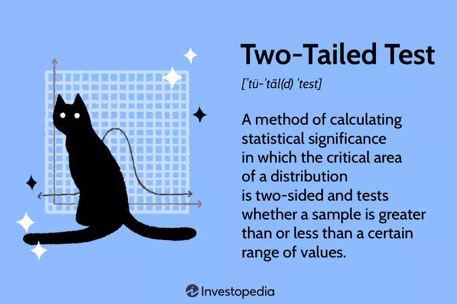

```{=html}
<style>
.header-row {
  display: flex;
  justify-content: space-between; /* title left, button right */
  align-items: center;
  margin-bottom: 1em; /* spacing below header */
}

.page-title {
  font-size: 2rem;   /* matches H1 style */
  font-weight: 700;
  margin: 0;
}

.download-btn {
  display: inline-block;
  background-color: #5FA2F3;  /* lighter R blue */
  color: white !important;
  padding: 8px 16px;
  border-radius: 8px;
  text-decoration: none;
  font-weight: 600;
  font-size: 14px;
}

.download-btn:hover {
  background-color: #4C93E6;
  color: white !important;
  text-decoration: none;
}
</style>
```

<!-- Flex container aligns title and button with text margin -->

::: header-row
<h1 class="page-title">

</h1>

<a href="Lec12_annotated.pdf" class="download-btn" download> ⬇ Download Annotated Slides </a>
:::


{fig-align="center" width="70%"}

In **statistical testing** - decision making with uncertainty - we aim to use our collected data to test a *null hypothesis* about the population of interest. For example researchers screen genetic variants for associations with a phenotype, or gene expression levels for associations with disease. 

Hypothesis testing quantifies how unusual the evidence is, **assuming that the null hypothesis is true.**

::: {.callout-important}
Hypothesis testing compares the value of your statistic (sample mean, etc) to what we would expect to see if the null hypothesis were true. If the data are too unsual, compared to what we expect under the null, then the null hypothesis is rejected.
:::


::: {.callout-note icon="false"}
**Example: is the coin fair?**
Suppose we flip a coin 100 times to see if it is fair.
:::

What is the null hypothesis?


What is the alternative hypothesis?


```{r}
set.seed(0xdada)
numFlips = 100
probHead = 0.6
coinFlips = sample(c("H", "T"), size = numFlips,
  replace = TRUE, prob = c(probHead, 1 - probHead))
head(coinFlips)
table(coinFlips)
```
What is the null distribution for the number to heads?


```{r}
#| message: false
library("dplyr")
k = 0:numFlips
numHeads = sum(coinFlips == "H")
binomDensity = tibble(k = k,
     p = dbinom(k, size = numFlips, prob = 0.5))
```

```{r}
library("ggplot2")
ggplot(binomDensity) +
  geom_bar(aes(x = k, y = p), stat = "identity") +
  geom_vline(xintercept = numHeads, col = "blue")
```
How do we quantify whether the observed value, 59, is likely to be seen with a fair coin, or whether its deviation from the expected value (50) is already large enough for us to conclude with enough confidence that the coin is biased? 

Choose a **significance level** $\alpha$ (e.g. 0.05). We define a rejection region $R$ consisting of outcomes that are sufficiently unlikely under $H_0$, such that $\Pr_{H_0}(X\in R)\le \alpha$. If the observed number of heads lies in $R$, we reject $H_0$; otherwise we do not reject.

The significance level is the evidential threshold we agree upon at the outset.

Sometimes the significance level is called the “alpha level” and denoted with $\alpha$.


::: {.callout-important}
**Reject or not to reject**
Null and alternative hypotheses do not have equal standing. The null hypothesis is the one being tested with the data. If the data is inconsistent with the null hypothesis we reject, otherwise, we do not reject.

:::

In our example, the alternative hypothesis includes parameter values on both sides of the parameter value specified by the null hypothesis. The test is referred as two-tailed.


```{r}
library("dplyr")
alpha = 0.05
binomDensity = arrange(binomDensity, p) |>
        mutate(reject = (cumsum(p) <= alpha))

ggplot(binomDensity) +
  geom_bar(aes(x = k, y = p, col = reject), stat = "identity") +
  scale_colour_manual(
    values = c(`TRUE` = "red", `FALSE` = "darkgrey")) +
  geom_vline(xintercept = numHeads, col = "blue") +
  theme(legend.position = "none")
```


{fig-align="center" width=0.6\textwidth}

The **p-value** is the probability (assuming the null distribution) of observing a value (test statistic) at least as extreme as the one observed.

In our case, this value is:

```{r}
2*pbinom(41,100,.5)

```

::: {.callout-important}
**Punch line:**  If the p-value of the data is less than or equal to $\alpha$ then the data are judged to provide enough statistically significant evidence in order reject the $H_{0}$ in favor of $H_A$.
:::


Question 1. Does the fact that we don’t reject the null hypothesis mean that the coin is fair?


Question 2. Would we have a better chance of detecting that the coin is not fair if we did more coin tosses? How many?


```{r}
binom.test(x = numHeads, n = numFlips, p = 0.5)
```


## t-test

## One population

You have data $x_1,\dots,x_n$ realizations from a population mean $\mu$. You want to test:

Null hypothesis: $H_0:\ \mu = 0$
Alternative hypothesis (choose one):

Two-sided: $H_1:\ \mu \neq 0$
Right-tailed: $H_1:\ \mu > 0$
Left-tailed: $H_1:\ \mu < 0$


Then the one-sample t statistic is
$$t = \frac{\bar{x} - 0}{s/\sqrt{n}} = \frac{\bar{x}}{s/\sqrt{n}}.$$
Under $H_0$ (and assuming approximate normality, or large $n$), this statistic follows a t distribution with
$$\text{df} = n-1$$
degrees of freedom.

Compute $t$ and the p-value from the $t_{n-1}$ distribution depending on the alternative:

Two-sided: $p = 2P(T \ge |t|)$
Right-tailed: $p = P(T \ge t)$
Left-tailed: $p = P(T \le t)$


Reject $H_0$ if $p \le \alpha$ (e.g., $\alpha = 0.05$).

Confidence interval connection:

A two-sided t-test at level $\alpha$ is equivalent to checking whether 0 lies in the $(1-\alpha)$ CI:
$$\bar{x} \pm t_{1-\alpha/2,\ n-1}\,\frac{s}{\sqrt{n}}.$$

## Two population difference


You have data $x_1,\dots,x_n$ realizations from a population mean $\mu_{x}$, and you have data $y_1,\ldots, y_{n}$ from a population with mean $\mu_{y}$

Null hypothesis: $H_0:\ \mu_{1}-\mu_{2} = 0$
Alternative hypothesis (choose one):

Two-sided: $H_1:\ \mu_{1}-\mu_{2} \neq 0$
Right-tailed: $H_1:\ \mu_{1}-\mu_{2} > 0$
Left-tailed: $H_1:\ \mu_{1}-\mu_{2} < 0$


Then the two-sample t statistic is

$$t=\frac{(\bar{x}_{1}-\bar{x}_{2})-0}{SE_{(\bar{x}_{1}-\bar{x}_{2})}} $$

Under $H_0$ (and assuming approximate normality, or large $n$), this stat
istic follows a t distribution with
$$\text{df} =\mathrm{df}
=
\frac{\left(\frac{s_x^2}{n_x}+\frac{s_y^2}{n_y}\right)^2}
{\frac{\left(\frac{s_x^2}{n_x}\right)^2}{n_x-1}
+
\frac{\left(\frac{s_y^2}{n_y}\right)^2}{n_y-1}}$$
degrees of freedom.

Compute $t$ and the p-value from the $t$ distribution depending on the alternative:

Two-sided: $p = 2P(T \ge |t|)$
Right-tailed: $p = P(T \ge t)$
Left-tailed: $p = P(T \le t)$


Reject $H_0$ if $p \le \alpha$ (e.g., $\alpha = 0.05$).

```{r}
#stats::t.test(x, y, mu = 0)                 # Welch (default)
#stats::t.test(x, y, var.equal = TRUE)       # pooled equal-variance t-test
#stats::t.test(x, y, alternative="greater")  # H1: mu1 - mu2 > 0
```

**What happens if you want to test: Null hypothesis: $H_0:\ \mu_{1}-\mu_{2} = c$?**

## Randomization test (permutation test)

This is a two-sample test that does not assume normality; it assumes the treatment labels were assigned at random (and units are independent).

You observe outcomes from $n$ units, with $n_1$ labeled “treatment” and $n_2$ labeled “control”. To test
$$H_0:\ \text{no treatment effect}$$
Under $H_0$, the outcomes would be the same regardless of who was labeled treated, so the observed treatment labels are exchangeable. Therefore, any reassignment of the treatment labels (keeping $n_1$ treated) is equally likely.

Procedure

Choose a test statistic $T$ measuring difference between groups (e.g., $\bar Y_T-\bar Y_C$) and compute the observed statistic $T_{\text{obs}}$.

Re-randomize: repeatedly shuffle the treatment labels (or enumerate all shuffles), recompute $T$ each time.
The p-value is the fraction of shuffles where $T$ is at least as extreme as $T_{\text{obs}}$ (two-sided uses $|T|$).

**Example:**

Outcomes: $y = [5,6,7,8,1,2,3,4]$
Observed assignment: first 4 are treated, last 4 are control
Treated: $[5,6,7,8]$, Control: $[1,2,3,4]$

Test statistic: difference in means
$$T = \bar y_T - \bar y_C.$$
Observed:
$$\bar y_T = 6.5,\quad \bar y_C = 2.5,\quad T_{\text{obs}}=4.0.$$
Under $H_0$, any choice of 4 of the 8 units could have been labeled “treated” (there are $\binom{8}{4}=70$ assignments). The randomization test:

computes $T$ for each of the 70 possible labelings,
compares them to $4.0$.

```{r}
y <- c(5,6,7,8,1,2,3,4)
z <- c(1,1,1,1,0,0,0,0)  # 1=treat, 0=control

Tobs <- mean(y[z==1]) - mean(y[z==0])

set.seed(1)
B <- 10000
Tperm <- replicate(B, {
  zperm <- sample(z)  # shuffle labels (keeps 4 treated)
  mean(y[zperm==1]) - mean(y[zperm==0])
})

p_two_sided <- mean(abs(Tperm) >= abs(Tobs))
Tobs
p_two_sided
```


Here, $T_{\text{obs}}=4.0$ is actually the maximum possible difference in means (treated got the four largest outcomes), so the two-sided randomization p-value is
$$p = \frac{1}{70}\approx 0.0143$$
(only the observed assignment is as extreme

Reference: Modern Statistics for Modern Biology
